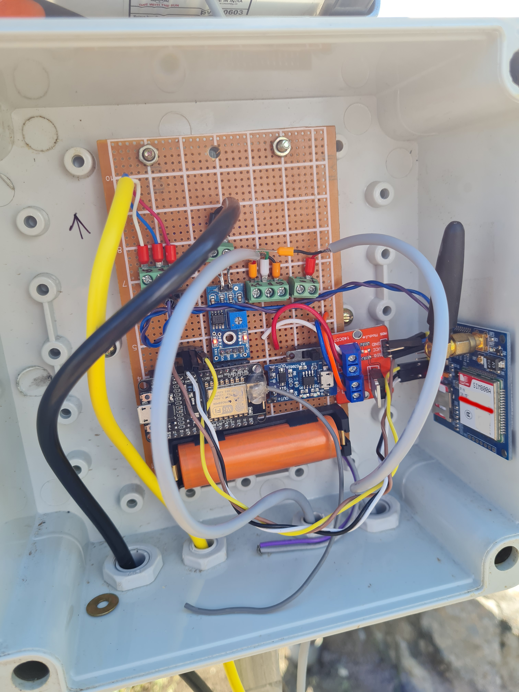
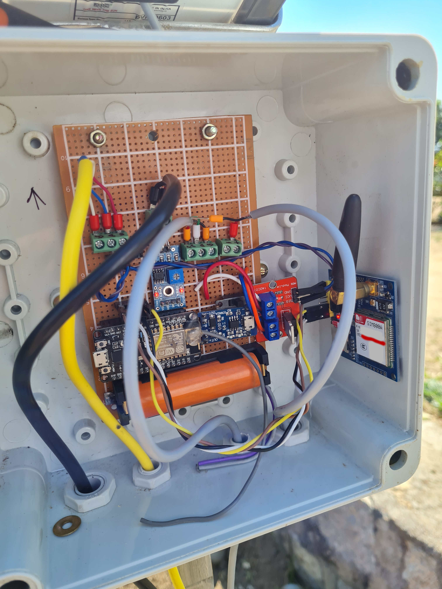
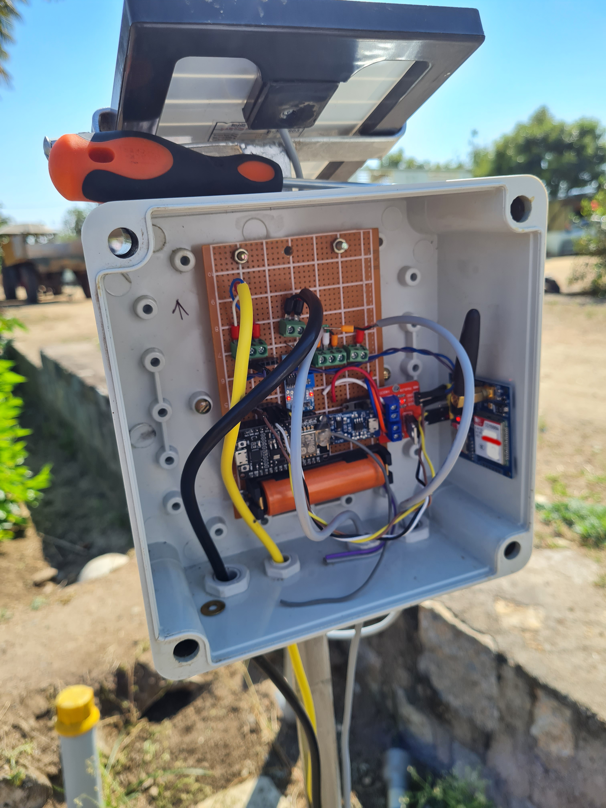

# Soil-Data-Monitoring 
# Soil Monitoring system wirelessly  with ESP8266 and GSM module using ESP-NOW protocol and AWS. 
# Hardware Used 
- ESP8266 
- ACCLIMA TDR315H
- DS18B20 
- ANALOG SOIL MOISTURE SENSOR 
- SIM 900A 
- SOLAR PANNEL 
- TP4056 
- 18650 CELL 

# Webserver AWS

To view Stored data on Database

http://65.0.5.138/display.php

# Images 

Exterior 

